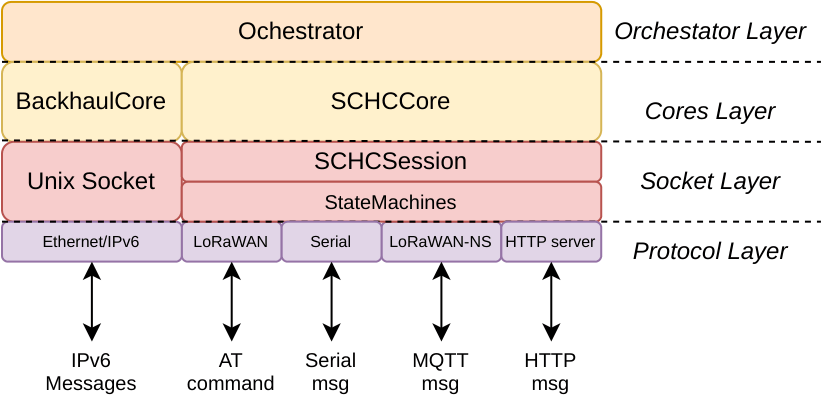
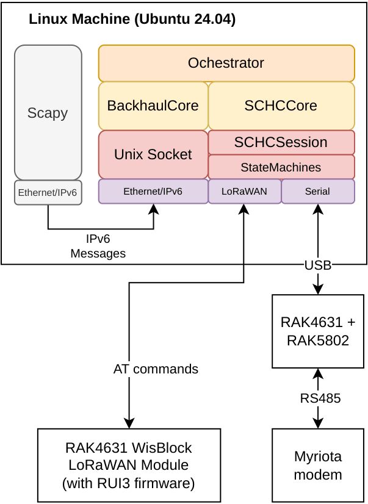
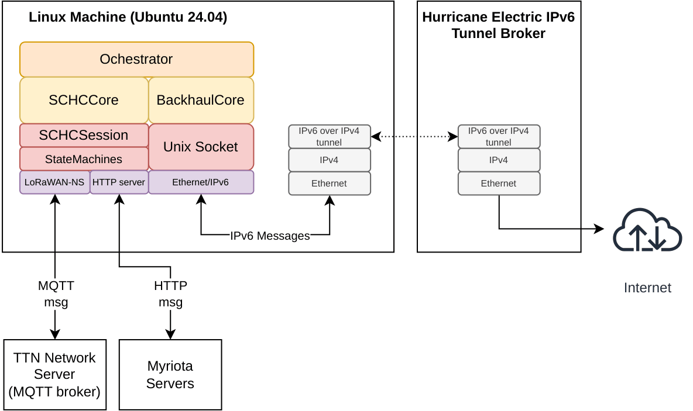

# ModularSCHC: A SCHC core logic in C++

[TOC]

# Introduction
ModularSCHC is an implementation of the Static Context Header Compression & Fragmentation (SCHC) standard based on the following documents:

-   [RFC 8724](https://www.rfc-editor.org/rfc/rfc8724.html) --> SCHC: Generic Framework for Static Context Header
    Compression and Fragmentation
    -   Compression/Decompression Actions (CDA)
    -   Fragmentation/Reassembly
        -   SCHC F/R Protocol Elements
        -   SCHC F/R Message Formats
        -   SCHC F/R Modes: only ACK-on-Error implemented
-   [RFC 9011](https://www.rfc-editor.org/rfc/rfc9011.html) --> Static Context Header Compression and Fragmentation (SCHC)
    over LoRaWAN

-   [RFC 9441](https://www.rfc-editor.org/rfc/rfc9441.html) --> Static Context Header Compression (SCHC) Compound
    Acknowledgement (ACK)

ModularSCHC is designed modularly to integrate different technologies
into the compression and fragmentation process. The software can
function as an SCHC Node or as an SCHC Gateway. The choice of operating
mode is controlled at the compilation and configuration levels. [Figure 1](#modularschc_architecture) shows the ModularSCHC
architecture. The implementation is divided into four layers.

-   The first layer (from bottom to top) is the ***protocol layer***.
    This layer allows the integration of different communication
    protocols through which SCHC or IPv6 messages are sent or received.

-   The second is the ***socket layer***. This layer implements the
    socket logic for connecting to IPv6 networks and SCHC state
    machines. This layer is responsible for processing each received
    message associated with an SCHC fragmentation session.

-   The third layer is called ***Cores layer***. This layer implements
    the management (creation and deletion) of both IPv6/Ethernet and
    SCHC sessions.

-   Finally, there is the ***Orchestration layer***, responsible for
    passing messages between Cores, based on source and destination
    identifier rules.

  
   
  <small><em>Figure 1: Architecture of ModularSCHC.</em></small>

# Getting Started

The first step in installing ModularSCHC is to decide whether the device
where the software will be installed will function as an SCHC Node
(end-device) or as an SCHC Gateway. The steps for deploying ModularSCHC
are as follows:

## Requirements

Although ModularSCHC was developed in C++, its use is only guaranteed
for the Linux operating system, specifically Ubuntu 24.04. The necessary
packages are:

-   gcc, version 13.3.0
-   Git, version 2.43.0
-   libmosquitto, version 2.0.18
-   fmt, version 9.1.0
-   spdlog, version 1.12.0
-   cmake, version 3.28.3

## Installation

The following steps are the same for installing ModularSCHC as an SCHC
node or SCHC gateway.

1.  Create a directory to download the project.
2.  Clone the project:

                git clone https://github.com/RodrigoMunozLara/ModularSCHC.git

3.  Compile the project: ModularSCHC is compiled by SCHC sublayer. This
    means that the code implementing the SCHC fragmentation sublayer is
    compiled separately from the code implementing the SCHC compression
    sublayer. To compile the fragmentation sublayer, perform the
    following steps:

    1.  Navigate to the `ModularSCHC/FragmentationSCHC` folder and
        create a temporary folder named `build`

                cd cd ModularSCHC/FragmentationSCHC/
                mkdir build
                

    2.  Go to the build folder and run the following command:

                cd build
                cmake -DCMAKE_BUILD_TYPE=Debug .. && cmake --build .
                

    3.  This will create two directories for running ModularSCHC as
        either an SCHC Node or an SCHC Gateway. Within each directory,
        you will find a binary and a configuration file. The path to the
        directories is as follows:

        -   For the SCHC Node:

                    ModularSCHC/FragmentationSCHC/binaries/schc_node

        -   For the SCHC Gateway:

                    ModularSCHC/FragmentationSCHC/binaries/schc_gateway

# ModularSCHC as a SCHC Node

When ModularSCHC acts as an SCHC node, it fragments an IPv6 packet and
sends the fragments to the SCHC gateway using SCHC messages. The IPv6
packet can originate from the same Linux machine where ModularSCHC is
installed or from a machine on the same subnet. Conversely, when
ModularSCHC receives SCHC messages containing fragments, it reassembles
those fragments to construct a complete IPv6 packet. This packet is then
delivered to the destination indicated by the destination IPv6 address.
[Figure 2](#modularschc_schc_node) shows the architecture for a SCHC
node.

  
   
  <small><em>Figure 2: SCHC Node architecture.</em></small>

The SCHC stack can connect via two technologies:

-   To a RAK brand SoC, model RAK4631, using AT commands. The RAK4631
    SoC supports LoRaWAN communication, or
-   using a Myriota satellite modem. Communication is carried out via
    the serial port, using the RS-485 protocol.

To convert a RAK4631 module to a RAK4631-R module and thus support AT
commands, follow the steps indicated in the following link
[@RAK4631-RUpdate].

# ModularSCHC as a SCHC Gateway

When ModularSCHC acts as an SCHC gateway, it receives SCHC messages
containing fragments of an IPv6 packet, reassembles these fragments to
construct a complete IPv6 packet, and then sends it through an
IPv6-over-IPv4 tunnel. If the SCHC gateway receives an IPv6 packet from
the IPv6-over-IPv4 tunnel, it fragments the packet and sends the
fragments to the SCHC node using SCHC messages. The IPv6 packet can only
originate from the IPv6-over-IPv4 tunnel. [Figure 3](#modularschc_schc_gateway) shows the architecture for a
SCHC node.

  
   
  <small><em>Figure 3: SCHC Gateway architecture.</em></small>

The SCHC stack can connect via two technologies:

-   to an MQTT broker on TheThingsNetwork (TTN) servers. The SCHC
    gateway subscribes to a topic using the libmosquitto library. or
-   To Myriota's servers via HTTP messages.

# Configuration File

The configuration file is called `config_frag.json`. A sample
configuration file can be found at the following path
`ModularSCHC/FragmentationSCHC/config`. This file is written in JSON
format and is divided into eight sections.

-   **general** (used in the SCHC node and the SCHC gateway)
-   **logging** (used in the SCHC node and the SCHC gateway)
-   **backhaul_core** (used in the SCHC node and the SCHC gateway)
-   **schc_core** (used in the SCHC node and the SCHC gateway)
-   **mqtt** (only used in the SCHC gateway)
-   **lorawan_node** (only used in the SCHC node)
-   **myriota_node** (only used in the SCHC node)
-   **myriota_http** (only used in the SCHC gateway)

## general section

This section configures the general parameters of the ModuleSCHC. This
section must be used on an SCHC gateway and an SCHC node. It is divided
into the following subsections:

-   **cores**: Selects the cores that will be instantiated when the
    binary is executed. It is represented as an strings array.

    -   schc_core: activate the core SCHC (see [figure 1](#modularschc_architecture))
    -   backhaul_core: activate the core backhaul (see [figure 1](#modularschc_architecture))
    -   example: `“cores”: [“schc_core”,“backhaul_core”]`

## logging section

This section configures the logs parameters. This section must be used
on an SCHC gateway and an SCHC node. It is divided into the following
subsections:

-   **log_level**: Selects the log level that will be used. It is
    represented as an string.

    -   TRACE
    -   DEBUG
    -   INFO
    -   WARN
    -   ERROR
    -   CRITICAL
    -   OFF
    -   example: `“log_level”: “DEBUG”`

## backhaul_core section

This section configures the parameters of the Backhaul Core. This
section must be used on an SCHC gateway and an SCHC node. It is divided
into the following subsections:

-   **6to4_tunnel**: activate or do not activate the ipv6 tunnel over
    ipv4. It is represented as an string.

    -   false
    -   true
    -   example: `“6to4_tunnel”: “true”`

-   **interface**: If 6to4_tunnel is true, then interface is the name of
    the interface where the tunnel will be set up. If 6to4_tunnel is
    false, then interface is the name of the interface where IPv6
    packets will be listened for. It is represented as an string.

    -   lo
    -   eth0
    -   example: `“interface”: “lo”`

## schc_core section
This section configures the parameters of the SCHC Core. This section
must be used on an SCHC gateway and an SCHC node. It is divided into the
following subsections:

-   **schc_type**: Define the type of SCHC device. It is represented as
    an string.

    -   schc_node
    -   schc_gateway
    -   example: `“schc_type”: “schc_node”`

-   **schc_l2_protocol**: Define the protocol type of the Protocol Layer
    (see figure [1](#fig:modularschc_architecture){reference-type="ref"
    reference="fig:modularschc_architecture"}). It is represented as an
    string. You can select only one protocol type.

    -   lorawan_at
    -   lorawan_ns_mqtt
    -   lorawan_ns_http
    -   myriota_at
    -   myriota_ns_http
    -   example: `“schc_l2_protocol”: “lorawan_ns_mqtt”`

-   **ack_end_win**: Define the acknowledgment mechanism or whether or
    not SCHC-HARQ mode is activated. It is represented as an string.

    -   ack_end_win
    -   ack_end_session
    -   compound_ack
    -   arq_fec
    -   example: `“ack_end_win”: “compound_ack”`

-   **error_prob**: Select the frame loss rate on the receiver. This is
    used for fragment loss simulation. It is represented as an string.

    -   number between 0 and 100.
    -   example: `“error_prob”: “10”`

## mqtt section

This section configure the connection parameters to the The Things
Network MQTT broker represented by LoRAWAN-NS protocol block (see
Protocol Layer in figure
[1](#fig:modularschc_architecture){reference-type="ref"
reference="fig:modularschc_architecture"}). This section must be used on
an SCHC gateway. It is divided into the following subsections:

-   **host**: Define the URL of the MQTT broker. It is represented as an
    string.

    -   example: `“host”: “nam1.cloud.thethings.network”`

-   **port**: Define the port to connect to the MQTT broker. It is
    represented as an string.

    -   example: `“port”: “1883”`

-   **username**: Define the username to connect to the MQTT broker. It
    is represented as an string.

    -   example: `“username”: “rmunoz-schc@ttn”`

-   **password**: Define the username to connect to the MQTT broker. It
    is represented as an string.. It is represented as an string.

    -   example:
        `“password”: “asdfsadfD4H7AG7HasdfasKINF43XPNX3E7GFPYQ.Hsadfsdfdsadf”`

## lorawan_node section

This section configures the connection parameters of the end device to
the LoRaWAN network. This section must be used on an SCHC node. It is
represented by LoRAWAN protocol block (see Protocol Layer in figure
[1](#fig:modularschc_architecture){reference-type="ref"
reference="fig:modularschc_architecture"}). It is divided into the
following subsections:

-   **serial_port**: Serial port of the Linux machine through which AT
    commands are sent to connect to the RAK4631 module. It is
    represented as an string.

    -   example: `“serial_port”: “/dev/ttyACM0”`

-   **deveui**: a 64-bit globally unique device identifier in IEEE EUI64
    address space that uniquely identifies the end-device. It is
    represented as an string.

    -   example: `“deveui”: “AC1F08FBBE0CEE56”`

-   **appeui**: a 64-bit globally unique application identifier in IEEE
    EUI64 address space that uniquely identifies the entity able to
    process the Join-req frame. It is represented as an string.

    -   example: `“appeui”: “0000000000000001”`

-   **appkey**: is an AES-128 bit secret key known as the root key. The
    same AppKey should be provisioned onto the network where the end
    device is going to register. It is represented as an string.

    -   example: `“appkey”: “A3B098925017F4574FBA536911C76CCC”`

-   **data_rate**: Define the data rate that the SCHC node will use. The
    use of Adaptive Data Rate (ADR) is not allowed. It is represented as
    an string.

    -   example: `“data_rate”: “DR4”`

## myriota_node section

This section configures the connection parameters to the Myriota modem.
This section must be used on an SCHC node. It is represented by Serial
protocol block (see Protocol Layer in figure
[1](#fig:modularschc_architecture){reference-type="ref"
reference="fig:modularschc_architecture"}). It is divided into the
following subsections:

-   **serial_port**: Serial port of the Linux machine through which
    message are sent to connect to the Myriota modem. It is represented
    as an string.

    -   example: `“serial_port”: “/dev/ttyACM0”`

## myriota_http section

This section configures the connection parameters to the Myriota
Servers. This section must be used on an SCHC gateway. It is represented
by HTTP server protocol block (see Protocol Layer in figure
[1](#fig:modularschc_architecture){reference-type="ref"
reference="fig:modularschc_architecture"}). It is divided into the
following subsections:

-   **port**: Define the port on which the Linux machine listens for
    messages from Myriota servers. It is represented as an string.

    -   example: `“port”: “18080”`

-   **ngrok_user**: Defines the ngrok service user that exposes the port
    on the Linux machine to which the Myriota server should connect. It
    is represented as an string.

    -   example: `“ngrok_user”: “schc”`
